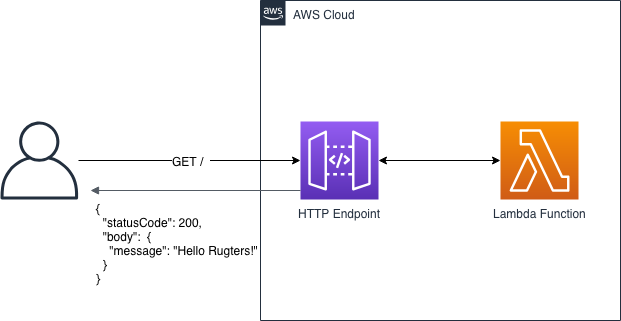
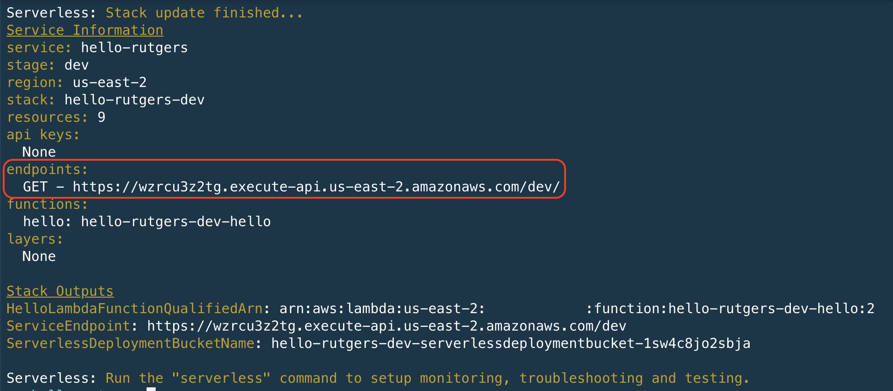

# Lab 1 - Hello Rutgers using Serverless Framework

## Overview
In this lab, we're going to build a simple "Hello Rutgers" API. The goal of our API will be the following:
* Create an HTTP endpoint in which we can send a GET request to
* Have the endpoint respond back with an appropriate 200 status code and a JSON payload

To accomplish this, we will use the [Serverless Framework](https://serverless.com/) to create the necessary components and deploy them into our AWS account.

Additionally, we'll be doing all the work from our Cloud9 instance.  Doing so will provide everyone a consistent IDE, but most importantly, seamlessly provide credentials!



### Part 1 - Cloud9

First things first, we need to log in to our Cloud9 instance and set up our environment.

1. Use the [table](../README.md) to find your name and corresponding AWS account. Each participant will get their own AWS account!
1. At the sign in page, use the credentials provided on the board.
1. In the upper right hand corner, ensure your region is set to **US East (Ohio)**
1. From the **Services** dropdown menu, type `Cloud9`, and select it from the auto-complete menu.
1. You should now see the list of available Cloud9 environments for you to launch. In the environment called **rutgers**, click **Open IDE**. This will launch your Cloud9 instance.
1. From here, we'll need to install the [Serverless Framework](https://serverless.com/). Luckily, this is pretty easy courtesy of **npm**.
1. From the terminal, type:

```
npm install serverless -g
```

7. Confirm it's installed properly. Let's run a simple version test:

```
serverless --version

# Can also use sls for short
sls -v
```

Your output should look something like:
```bash
$ serverless --version
1.48.2 (Enterprise Plugin: 1.3.1, Platform SDK: 2.0.3)
```
That's it! Let's create and deploy our Hello Rutgers API.

### Part 2 - Create a Service

The [Serverless Framework](https://serverless.com/) uses the notion of services to deploy your serverless applications. A service can be as simple as a single API, or entire application that is composed of hundreds or thousands of functions. In our example, we'll be creating a simple service with one API endpoint.

Let's explore the serverless CLI a bit.

1. From the terminal, run

```
sls create --help
```

This will show us the various options for creating a serverless service.

2. Make sure we're in the proper working directory. 

```
cd ~/environment
```

3. Let's use what we learned above to create a service. Run:

```
sls create --template aws-python3 --path hello-rutgers && cd hello-rutgers
```

4. Take a peak around at this new directory. You should see 2 new files: **handler.py** and **serverless.yml**
5. Open **serverless.yml** by double-clicking on it from the file browser on the left and explore.
6. Open **handler.py** by double-clicking on it from the file browser on the left and explore.
7. Before we deploy this service, let's create the deployment artifacts first and explore them. Run:

```
sls package --stage dev --region us-east-2
```

This will create the directory **.serverless/** which will contain the [AWS CloudFormation](https://aws.amazon.com/cloudformation/) templates used to deploy the service.

8. Now let's deploy our new service: 

```
sls deploy --verbose --stage dev --region us-east-2
```

### Part 3 - Add an HTTP Endpoint

With our service successfully deployed, we need to put an HTTP endpoint in front of our Lambda function to accept a GET request. 

1. Open the **serverless.yml** file.
2. Under the functions -> handler -> hello stanza, add the following:

```
    events:
      - http:
          path: /
          method: get
```

3. Save the file by going to File -> Save or hitting **ctrl + s** or **cmd + s**.
4. Open the **handler.py** file.
5. Edit the value for body to the following:

```json
    body = {
        "message": "Hello Rutgers!"
    }
```

6. Save the file.
7. Deploy our changes: 

```
sls deploy --verbose --stage dev --region us-east-2
```

8. Look at the output returned from the deployment for the HTTP endpoint. Copy and paste the URL in your browser to test!


That's it! Nice work.

### Part 4 - Logging

Now that we have a working API endpoint, let's make sure we can log messages in case we need to debug or troubleshoot down the road. 

1. Open the **handler.py** file.
2. Add the following right above the `return response` line:

```python
    try:
        print('Agent: {}'.format(event['headers']['User-Agent']))
        print('IP: {}'.format(event['headers']['X-Forwarded-For']))
    except KeyError:
        print('No headers to print')
```

3. This will print **User-Agent** and **source IP** address that is sent to the Lambda function to CloudWatch Logs. We can use the Serverless CLI to watch these logs as we invoke our API. First, we need to deploy the changes.
4. Save the file and deploy. Since we only changed the function and not the **serverless.yml** file, we can simply deploy the updated function by itself: 

```
sls deploy --function hello --verbose --stage dev --region us-east-2
```

5. Start watching the logs: 

```
sls logs -f hello -t -s dev -r us-east-2
```

6. Invoke the endpoint once more and watch for changes in the logs

### Part 5 - Run Locally

What if you wanted to test your application locally? Or maybe you want to pass arbitrary data to the function? For that, you can invoke your function locally. Here's how we can do that:

1. To run our function locally, we can simply use the `invoke local` command:

```
sls invoke local --function hello
```

2. Note that at the top we get a message that states `No headers to print`. This is because from the CLI we are not passing the same event data as we would from a browser. If we'd like to pass that data, we can add the `--data` argument.

```
sls invoke local --function hello --data '{"headers":{"User-Agent": "From the CLI", "X-Forwarded-For": "localhost"}}'
```

Your output should look something like:

```bash
Agent: From the CLI
IP: localhost

{
    "statusCode": 200,
    "body": "{\"message\": \"Hello Rutgers!\"}"
}
```

**Extra credit:** Try passing different combination of data and see what happens.

:exclamation: Since you are emulating the Lambda environment, the Lambda function will assume the permissions of the credentials stored locally, and **not** the permissions you specified in your serverless configuration. These permissions will most likely be different!

### Clean up

Congratulations!  You've successfully completed Lab 1, take a moment to clean up:

```
sls remove --stage dev --region us-east-2
```