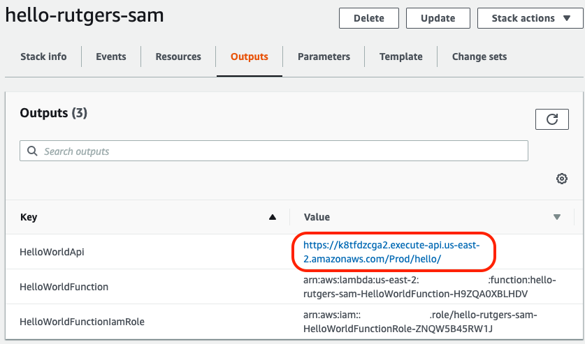

# Lab 2 - Hello Rutgers using SAM

## Overview
In this lab, we're going to build a simple "Hello Rutgers" API using the [Serverless Application Model](https://aws.amazon.com/serverless/sam/) or [SAM](https://aws.amazon.com/serverless/sam/) for short. The goal of our API will be the following:
* Create an HTTP endpoint in which we can send a GET request to
* Have the endpoint respond back with an appropriate 200 status code and a JSON payload

The architecture will mirror what we built in Lab 1, but we'll be using a different framework to build and deploy the application.


### Part 1 - Install the SAM CLI

Like the Serverless Framework, SAM provides an interactive CLI to build, package, test, and deploy serverless applications. Let's install the latest version of the SAM CLI before we proceed.

1. From the terminal, type:

```
pip install --user aws-sam-cli --upgrade
```

2. Confirm it's installed properly. Let's run a simple version test: 

```
sam --version
```

Your output should look something like:
```bash
$ sam --version
SAM CLI, version 0.18.0
```
That's it! Let's create and deploy our Hello Rutgers API.

### Part 2 - Initialize the Project

When we initialize a project with the SAM CLI, it will create a directory with stock templates and an example function in the runtime we specify.

Let's explore the SAM CLI a bit.

1. From the terminal, run

```
sam init --help
```

This will show us the various options for initializing a SAM project.

2. Make sure we're in the proper working directory. 

```
cd ~/environment
```

3. Let's use what we learned above to create a project. Run:

```
sam init --runtime python3.6 --name hello-rutgers-sam && cd hello-rutgers-sam
```

4. Take a peak around at this new directory. You should see a few new files and two directories:

```
|_ event.json
|_ hello_world/
|_ README.md
|_ template.yaml
|_ tests/
```

5. Open **template.yaml** by double-clicking on it from the file browser on the left and explore.
6. Open **hello_world/app.py** by double-clicking on it from the file browser on the left and explore.
7. Let's edit our function to make sure it responds back to us in a friendly way. Modify the return statement like so:

```python
    return {
        "statusCode":
        200,
        "body":
        json.dumps({
            "message": "Hello Rutgers, from SAM!",
            # "location": ip.text.replace("\n", "")
        }),
    }
```

8. Now we need to package our project up and deploy it with CloudFormation. Before moving forward, though, we need to create an S3 bucket which will store the code for our Lambda function. We'll use the AWS CLI to create the bucket first: 

```
aws s3 mb s3://<your last name>-sam/
```

Make sure you replace `<your last name>` with your actual last name.

9. Now that we have an S3 bucket, let's package our project up:

```
sam package --s3-bucket <your last name>-sam --template-file template.yaml --output-template-file package.yaml
```

10. So what did that just do? We created a zip file of our Lambda function, uploaded it to S3, and created a new CloudFormation template called **package.yaml**, with the appropriate values filled in from our `package` command. Now all we have to do is deploy our template.
11. Run the following to deploy the template:

```
sam deploy --template-file package.yaml --stack-name hello-rutgers-sam --capabilities CAPABILITY_IAM
```

12. Let's test our endpoint. Jump over to the CloudFormation console and click on the **Outputs** tab. 



### Part 3 - Test Locally

One of the awesome features with SAM is the ability to test and debug your applications locally. With SAM, you can actually stand up an HTTP endpoint locally (mock API Gateway) and make requests against it, which in turn will invoke your local Lambda function. 

1. To run your API locally, simply run the following:

```
sam local start-api
```

You should see output similar to the following:

```
2019-07-23 22:26:41 Mounting HelloWorldFunction at http://127.0.0.1:3000/hello [GET]
2019-07-23 22:26:41 You can now browse to the above endpoints to invoke your functions. You do not need to restart/reload SAM CLI while working on your functions, changes will be reflected instantly/automatically. You only need to restart SAM CLI if you update your AWS SAM template
2019-07-23 22:26:41  * Running on http://127.0.0.1:3000/ (Press CTRL+C to quit)
```

2. Open a new Terminal window, and run curl against this endpoint:

```
curl http://localhost:3000/hello
```

Give it a few seconds - it'll need to download the latest Lambda docker container. Your output should look similar to:

```json
{"message": "Hello Rutgers, from SAM!"}
```

### Part 4 - Logging

To view the logs for our application, we can either jump into the CloudWatch Logs console, or use the `sam logs` command from the CLI. Let's take a look:

1. From the terminal, run the command:

```
sam logs -n HelloWorldFunction --stack-name hello-rutgers-sam
```

2. If you don't see any output, not to worry. By default, this command will display logs from 10 minutes ago. If you want, you can specify a relative time or a time range. For example:

```
# Logs from up to 15 minutes ago
sam logs -n HelloWorldFunction --stack-name hello-rutgers-sam -s '15min ago'

# Or a range from 30 minutes to 15 minutes ago
sam logs -n HelloWorldFunction --stack-name hello-rutgers-sam -s '30min ago' -e '15min ago'
```

3. What if you wanted to search for a particular string in your logs? `sam logs` can handle that too:

```
sam logs -n HelloWorldFunction --stack-name hello-rutgers-sam --filter "Memory"
```

### Part 5 - Serverless Applicaiton Repository
Imagine a scenario where you built a serverless application and wish to share it with others across your organization. Or perhaps you want to share it with the community at large. You could of course share a link to your public GitHub repository and let folks clone it and (hopefully) follow your deployment instructions. But what if there was a better way? Enter the [Serverless Application Repository](https://aws.amazon.com/serverless/serverlessrepo/). The Serverless Application Repository enables teams, organizations, and individual developers to store and share reusable applications, and easily assemble and deploy serverless architectures in powerful new ways. After you publish your application to the repository, you have the option to share it with select AWS accounts within your organization, or make it public for the rest of the AWS community to deploy into their own AWS accounts. 

We won't actually publish our application into the serverless application repository, but rather summarize the high-level steps one would follow:

1. Ensure your application meets the [prerequisites](https://docs.aws.amazon.com/serverless-application-model/latest/developerguide/serverless-sam-template-publishing-applications.html#serverless-sam-template-publishing-applications-prerequisites) for publication to the repository.
2. Add a **Metadata** section to your template. This section will include information about your application such as the License it should fall under, links to the source code, etc.
3. Package your application, using the SAM CLI.
4. Publish your application to the repository, again leveraging the SAM CLI.
5. Optionally, log in to the Serverless Application Repository and share your application with other AWS accounts or make it public.

### Clean up

Great!  You've successfully completed Lab 2, take a moment to clean up:

```
aws cloudformation delete-stack --stack-name hello-rutgers-sam
```