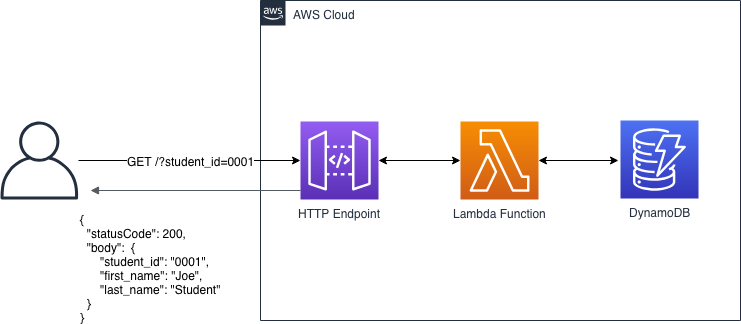
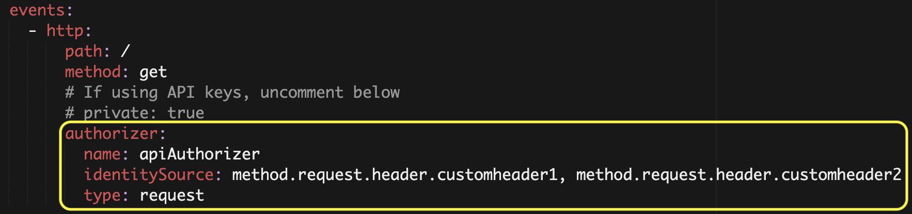
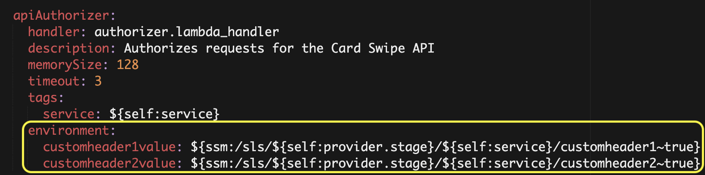
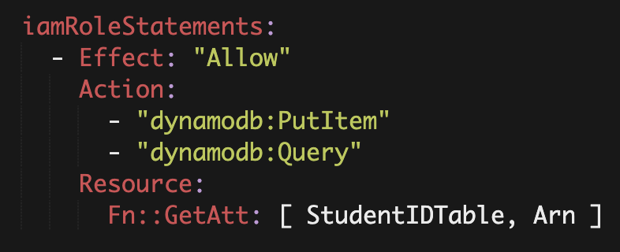
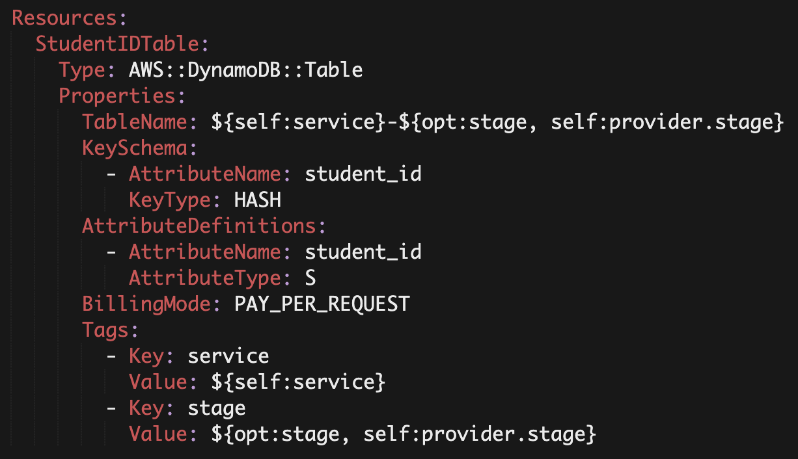
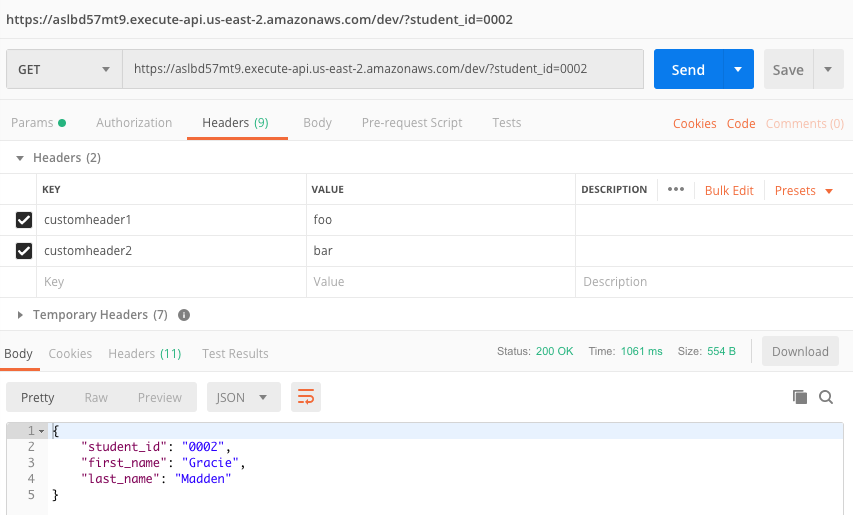
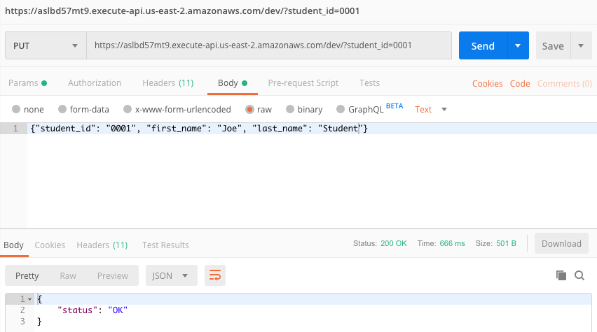

## Card Swipe API

This is a simple serverless application that serves two primary functions:
* When an HTTP GET is made and passed a student_id as a query string, returns the student_id, first and last names of the student from a database
* When an HTTP PUT is made with the appropriate JSON formatted data in the body, this will add the student information into the database



This has a few more components then our Hello Rutgers example, so let's dive into some of the new functionality we've added.

### Authorization

Since we don't want our endpoint to be accessed by anyone on the internet, we need to insert an authorization mechanism on our API Gateway endpoint. API Gateway [supports a number of different methods](https://docs.aws.amazon.com/apigateway/latest/developerguide/apigateway-control-access-to-api.html), and which one you choose will largely depend on your use case. In our application, we presume our existing card swipe system will programmatically call our API endpoint. For this case, we will use a Lambda authorizer.  For simplicity, we defined the Lambda authorizer function within this service, but you can just as well use an existing Lambda authorizer and specify it in the service configuration.



Our Lambda authorizer will look for 2 headers in each request: `customheader1` and `customheader2`. If these headers are not specified, or if their values are incorrect, API Gateway will return a 403 Unauthorized message. 

To store the values for these custom headers, we use Systems Manager Parameter Store. Read on for how we can set these values.

### Systems Manager Parameter Store

We use [SSM Parameter Store](https://docs.aws.amazon.com/systems-manager/latest/userguide/systems-manager-parameter-store.html) to store the values for our custom headers. AWS Systems Manager Parameter Store provides secure, hierarchical storage for configuration data management and secrets management. You can store data such as passwords, database strings, and license codes as parameter values. You can store values as plain text or encrypted data. You can then reference values by using the unique name that you specified when you created the parameter. 

You can use the [AWS CLI](https://aws.amazon.com/cli/) to store values in parameter store. For our application, we need to add parameters for `customheader1` and `customheader2`. Run the following, being sure to replace the value with something meaningful to you:

```
# Remember to replace the value with something useful
aws ssm put-parameter --name /sls/dev/rutgers-card-swipe/customheader1 --value foo --type SecureString
aws ssm put-parameter --name /sls/dev/rutgers-card-swipe/customheader2 --value bar --type SecureString
```

Serverless has a convenient helper function that allows us to reference the parameters directly from within our `serverless.yml` file:



We now have an encrytped key / value store for our custom header values, which will be version controlled, encrypted at rest and in transit, and can be restricted to specific IAM users and roles based on policies.

### Lambda Permissions

By default, the Serverless Framework gives our Lambda functions an execution role which provides it access to CloudWatch Logs for logging. In our sample application, however, our Lambda function also needs access to a DynamoDB table where the student information will be stored. We can define a IAM policy at the top of our `serverless.yml` file, granting it least-privilege access to the DynamoDB table:



Note that this policy references the **arn** of a DynamoDB table. But where did this table come from!?



The Serverless Framework allows you to define standard CloudFormation resources directly in the `serverless.yml` file. Additionally, you can then reference those resources throughout your configuration file, much like you would a standard CloudFormation template. More on this functionality [here](https://serverless.com/framework/docs/providers/aws/guide/resources/).

### Deploy the Serivce

With the parameters for the custom headers stored in Parameter Store, we can now deploy our service. 

```
sls deploy -v -s dev -r us-east-2
```

Note that the additional arguments there are optional as we defined defaults in the `serverless.yml` file which mirror them. 

### Load Student ID Table

Now that the service is deployed, we need to load data into the DynamoDB table so we can query it. In the `data/` directory, there are 2 files:
* **names.csv** contains a CSV file of ficticious names
* **load.py** is a python script which will read the CSV file and load them into the DynamoDB table

```
cd data
./load.py
```

### Query the API

Now it's time to test!  Below is an example screenshot using [Postman](https://www.getpostman.com/) to query the API Gateway endpoint, with `customheader1=foo` and `customheader2=bar`, with `student_id=0002`:



Altneratively, you can use a CLI utility like curl:

```
# Make sure to reference your own API endpoint!
curl -H "customheader1: foo" -H "customheader2: bar" https://aslbd57mt9.execute-api.us-east-2.amazonaws.com/dev/\?student_id\=0002
```

To add a new student to the table, simply make an `HTTP PUT` request to the same endpoint, and specify the appropriate data in the body of the request:



Or with curl:

```
# Make sure to reference your own API endpoint!
curl -d '{"student_id":"3004", "first_name":"Joe", "last_name": "Student"}' -H "customheader1: foo" -H "customheader2: bar" -X PUT https://aslbd57mt9.execute-api.us-east-2.amazonaws.com/dev/
```

### Clean Up

Great! You've successfully completed Lab 3, take a moment to clean up:

```
sls remove -s dev -r us-east-2
```